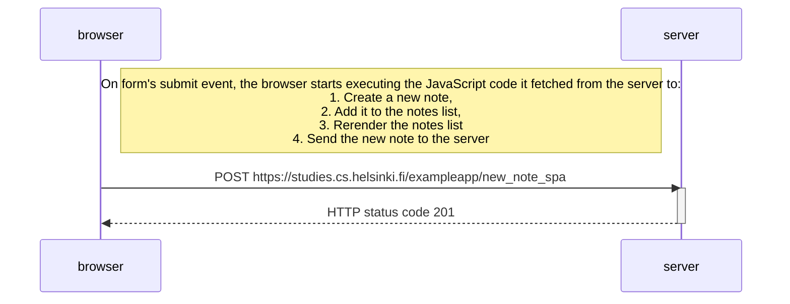

```mermaid

sequenceDiagram
    participant browser
    participant server

    Note right of browser: On form's submit event, the browser starts executing the JavaScript code it fetched from the server to: <br/> 1. Create a new note,<br/> 2. Add it to the notes list, <br/> 3. Rerender the notes list <br/> 4. Send the new note to the server
    
    browser->>server: POST https://studies.cs.helsinki.fi/exampleapp/new_note_spa
    activate server

    server-->>browser: HTTP status code 201
    deactivate server
    
```